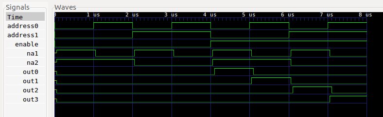
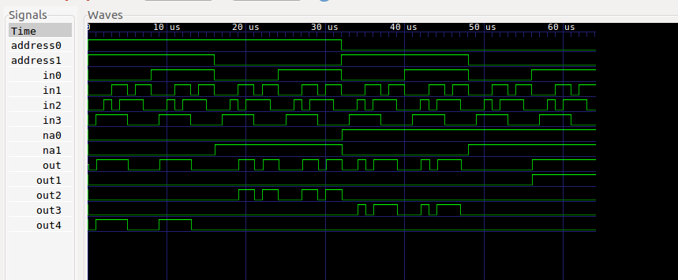
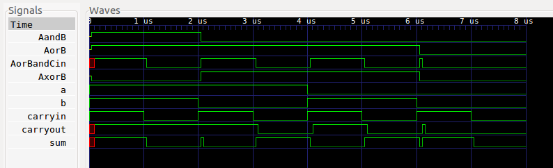

# Homework 2 Results

---
## 2-bit Decoder with Enable

```
En A0 A1| O0 O1 O2 O3 | Expected Output
0  0  0 |  0  0  0  0 | All false
0  1  0 |  0  0  0  0 | All false
0  0  1 |  0  0  0  0 | All false
0  1  1 |  0  0  0  0 | All false
1  0  0 |  1  0  0  0 | O0 Only
1  1  0 |  0  1  0  0 | O1 Only
1  0  1 |  0  0  1  0 | O2 Only
1  1  1 |  0  0  0  1 | O3 Only
```



---
## Four Input Multiplexer
```
A0 A1 | In0 In1 In2 In3 | Out0 | Expected Output
1  1  | 0  0  0  0  | 0 | 0
1  1  | 0  0  0  1  | 1 | 1
1  1  | 0  0  1  1  | 1 | 1
1  1  | 0  1  0  1  | 1 | 1
1  1  | 0  1  1  1  | 1 | 1
1  1  | 0  0  1  0  | 0 | 0
1  1  | 0  1  1  0  | 0 | 0
1  1  | 0  1  0  0  | 0 | 0
1  1  | 1  0  0  0  | 0 | 0
1  1  | 1  0  0  1  | 1 | 1
1  1  | 1  0  1  1  | 1 | 1
1  1  | 1  1  0  1  | 1 | 1
1  1  | 1  1  1  1  | 1 | 1
1  1  | 1  0  1  0  | 0 | 0
1  1  | 1  1  1  0  | 0 | 0
1  1  | 1  1  0  0  | 0 | 0
A0 A1 | In0 In1 In2 In3 | Out1 | Expected Output
1  0  | 0  0  0  0  | 0 | 0
1  0  | 0  0  0  1  | 0 | 0
1  0  | 0  0  1  1  | 0 | 0
1  0  | 0  1  0  1  | 1 | 1
1  0  | 0  1  1  1  | 1 | 1
1  0  | 0  0  1  0  | 0 | 0
1  0  | 0  1  1  0  | 1 | 1
1  0  | 0  1  0  0  | 1 | 1
1  0  | 1  0  0  0  | 0 | 0
1  0  | 1  0  0  1  | 0 | 0
1  0  | 1  0  1  1  | 0 | 0
1  0  | 1  1  0  1  | 1 | 1
1  0  | 1  1  1  1  | 1 | 1
1  0  | 1  0  1  0  | 0 | 0
1  0  | 1  1  1  0  | 1 | 1
1  0  | 1  1  0  0  | 1 | 1
A0 A1 | In0 In1 In2 In3 | Out2 | Expected Output
0  1  | 0  0  0  0  | 0 | 0
0  1  | 0  0  0  1  | 0 | 0
0  1  | 0  0  1  1  | 1 | 1
0  1  | 0  1  0  1  | 0 | 0
0  1  | 0  1  1  1  | 1 | 1
0  1  | 0  0  1  0  | 1 | 1
0  1  | 0  1  1  0  | 1 | 1
0  1  | 0  1  0  0  | 0 | 0
0  1  | 1  0  0  0  | 0 | 0
0  1  | 1  0  0  1  | 0 | 0
0  1  | 1  0  1  1  | 1 | 1
0  1  | 1  1  0  1  | 0 | 0
0  1  | 1  1  1  1  | 1 | 1
0  1  | 1  0  1  0  | 1 | 1
0  1  | 1  1  1  0  | 1 | 1
0  1  | 1  1  0  0  | 0 | 0
A0 A1 | In0 In1 In2 In3 | Out3 | Expected Output
0  0  | 0  0  0  0  | 0 | 0
0  0  | 0  0  0  1  | 0 | 0
0  0  | 0  0  1  1  | 0 | 0
0  0  | 0  1  0  1  | 0 | 0
0  0  | 0  1  1  1  | 0 | 0
0  0  | 0  0  1  0  | 0 | 0
0  0  | 0  1  1  0  | 0 | 0
0  0  | 0  1  0  0  | 0 | 0
0  0  | 1  0  0  0  | 1 | 1
0  0  | 1  0  0  1  | 1 | 1
0  0  | 1  0  1  1  | 1 | 1
0  0  | 1  1  0  1  | 1 | 1
0  0  | 1  1  1  1  | 1 | 1
0  0  | 1  0  1  0  | 1 | 1
0  0  | 1  1  1  0  | 1 | 1
0  0  | 1  1  0  0  | 1 | 1
```



---
## 1-bit Full Adder

```
A B Cin | S Cout | Expected Output
1  1  1 |  1  1 | 1 1
1  1  0 |  0  1 | 0 1
1  0  1 |  0  1 | 0 1
1  0  0 |  1  0 | 1 0
0  1  1 |  0  1 | 0 1
0  1  0 |  1  0 | 1 0
0  0  1 |  1  0 | 1 0
0  0  0 |  0  0 | 0 0
```

