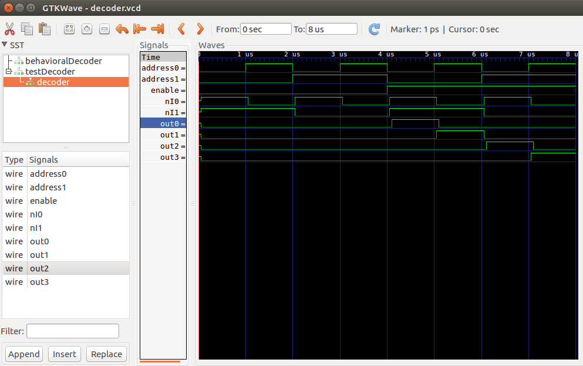
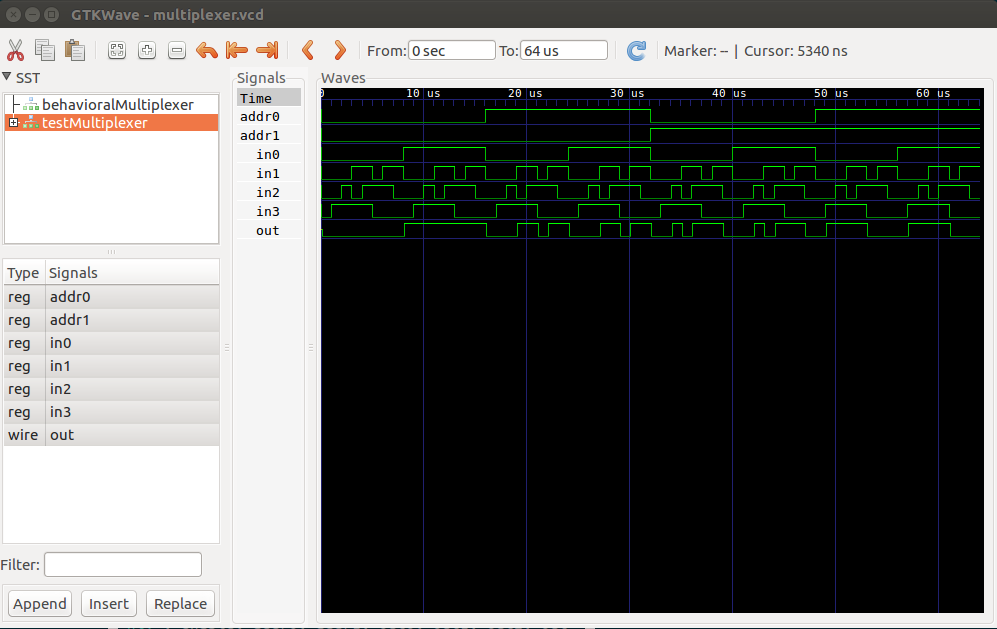
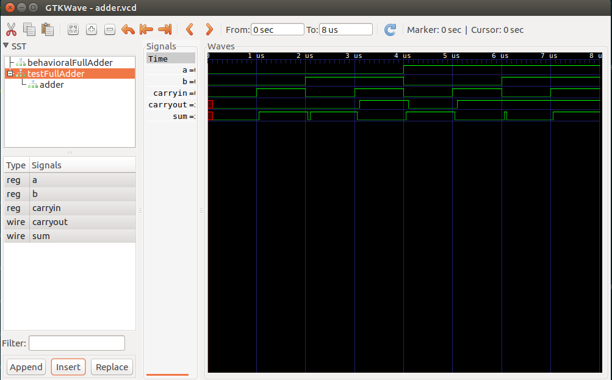

#HW2 Writeup
William Lu

##Structural Decoder

Truth table for the structural decoder as outputted from the decoder test bench:

```
En A0 A1| O0 O1 O2 O3 | Expected Output
0  0  0 |  0  0  0  0 | All false
0  1  0 |  0  0  0  0 | All false
0  0  1 |  0  0  0  0 | All false
0  1  1 |  0  0  0  0 | All false
1  0  0 |  1  0  0  0 | O0 Only
1  1  0 |  0  1  0  0 | O1 Only
1  0  1 |  0  0  1  0 | O2 Only
1  1  1 |  0  0  0  1 | O3 Only
```

Waveform for the structural decoder:



##Structural 4:1 Multiplexer

Truth table for the structural 4:1 multiplexer as outputted from the multiplexer test bench:

```
A0 A1 | I0 I1 I2 I3 | O | Expected 0utput
0  0  | 0  0  0  0  | 0 | 0
0  0  | 0  0  0  1  | 0 | 0
0  0  | 0  0  1  1  | 0 | 0
0  0  | 0  1  0  1  | 0 | 0
0  0  | 0  1  1  1  | 0 | 0
0  0  | 0  0  1  0  | 0 | 0
0  0  | 0  1  1  0  | 0 | 0
0  0  | 0  1  0  0  | 0 | 0
0  0  | 1  0  0  0  | 1 | 1
0  0  | 1  0  0  1  | 1 | 1
0  0  | 1  0  1  1  | 1 | 1
0  0  | 1  1  0  1  | 1 | 1
0  0  | 1  1  1  1  | 1 | 1
0  0  | 1  0  1  0  | 1 | 1
0  0  | 1  1  1  0  | 1 | 1
0  0  | 1  1  0  0  | 1 | 1
---------------------------
1  0  | 0  0  0  0  | 0 | 0
1  0  | 0  0  0  1  | 0 | 0
1  0  | 0  0  1  1  | 0 | 0
1  0  | 0  1  0  1  | 1 | 1
1  0  | 0  1  1  1  | 1 | 1
1  0  | 0  0  1  0  | 0 | 0
1  0  | 0  1  1  0  | 1 | 1
1  0  | 0  1  0  0  | 1 | 1
1  0  | 1  0  0  0  | 0 | 0
1  0  | 1  0  0  1  | 0 | 0
1  0  | 1  0  1  1  | 0 | 0
1  0  | 1  1  0  1  | 1 | 1
1  0  | 1  1  1  1  | 1 | 1
1  0  | 1  0  1  0  | 0 | 0
1  0  | 1  1  1  0  | 1 | 1
1  0  | 1  1  0  0  | 1 | 1
---------------------------
0  1  | 0  0  0  0  | 0 | 0
0  1  | 0  0  0  1  | 0 | 0
0  1  | 0  0  1  1  | 1 | 1
0  1  | 0  1  0  1  | 0 | 0
0  1  | 0  1  1  1  | 1 | 1
0  1  | 0  0  1  0  | 1 | 1
0  1  | 0  1  1  0  | 1 | 1
0  1  | 0  1  0  0  | 0 | 0
0  1  | 1  0  0  0  | 0 | 0
0  1  | 1  0  0  1  | 0 | 0
0  1  | 1  0  1  1  | 1 | 1
0  1  | 1  1  0  1  | 0 | 0
0  1  | 1  1  1  1  | 1 | 1
0  1  | 1  0  1  0  | 1 | 1
0  1  | 1  1  1  0  | 1 | 1
0  1  | 1  1  0  0  | 0 | 0
---------------------------
1  1  | 0  0  0  0  | 0 | 0
1  1  | 0  0  0  1  | 1 | 1
1  1  | 0  0  1  1  | 1 | 1
1  1  | 0  1  0  1  | 1 | 1
1  1  | 0  1  1  1  | 1 | 1
1  1  | 0  0  1  0  | 0 | 0
1  1  | 0  1  1  0  | 0 | 0
1  1  | 0  1  0  0  | 0 | 0
1  1  | 1  0  0  0  | 0 | 0
1  1  | 1  0  0  1  | 1 | 1
1  1  | 1  0  1  1  | 1 | 1
1  1  | 1  1  0  1  | 1 | 1
1  1  | 1  1  1  1  | 1 | 1
1  1  | 1  0  1  0  | 0 | 0
1  1  | 1  1  1  0  | 0 | 0
1  1  | 1  1  0  0  | 0 | 0
```

Waveform for the structural 4:1 multiplexer:



##Full Adder

Truth table for the structural full adder as outputted from the full adder test bench:

```
A  B  Cin | Cout  S | Expected Output
0  0   0  |  0    0 | 0    0
0  0   1  |  0    1 | 0    1
0  1   0  |  0    1 | 0    1
0  1   1  |  1    0 | 1    0
1  0   0  |  0    1 | 0    1
1  0   1  |  1    0 | 1    0
1  1   0  |  1    0 | 1    0
1  1   1  |  1    1 | 1    1
```

Waveform for the structural full adder:

