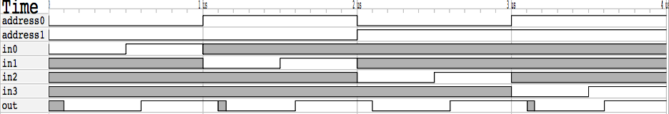
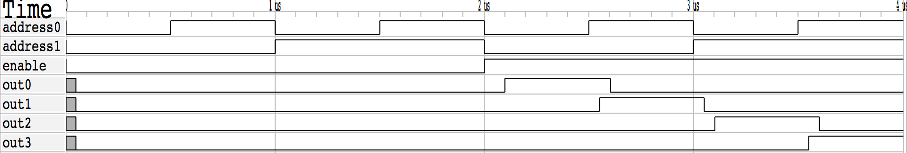

TJ Kim
HW 2 Submission

Multiplexor Behavioral

in0 in1 in2 in3| address0 address1 | out
 0   0   0   0 |     0      0      | 0
 0   0   0   0 |     0      1      | 0
 0   0   0   0 |     1      0      | 0
 0   0   0   0 |     1      1      | 0
 0   0   0   1 |     0      0      | 0
 0   0   0   1 |     0      1      | 0
 0   0   0   1 |     1      0      | 0
 0   0   0   1 |     1      1      | 1
 0   0   1   0 |     0      0      | 0
 0   0   1   0 |     0      1      | 1
 0   0   1   0 |     1      0      | 0
 0   0   1   0 |     1      1      | 0
 0   0   1   1 |     0      0      | 0
 0   0   1   1 |     0      1      | 1
 0   0   1   1 |     1      0      | 0
 0   0   1   1 |     1      1      | 1
 0   1   0   0 |     0      0      | 0
 0   1   0   0 |     0      1      | 0
 0   1   0   0 |     1      0      | 1
 0   1   0   0 |     1      1      | 0
 0   1   0   1 |     0      0      | 0
 0   1   0   1 |     0      1      | 0
 0   1   0   1 |     1      0      | 1
 0   1   0   1 |     1      1      | 1
 0   1   1   0 |     0      0      | 0
 0   1   1   0 |     0      1      | 1
 0   1   1   0 |     1      0      | 1
 0   1   1   0 |     1      1      | 0
 0   1   1   1 |     0      0      | 0
 0   1   1   1 |     0      1      | 1
 0   1   1   1 |     1      0      | 1
 0   1   1   1 |     1      1      | 1
 1   0   0   0 |     0      0      | 1
 1   0   0   0 |     0      1      | 0
 1   0   0   0 |     1      0      | 0
 1   0   0   0 |     1      1      | 0
 1   0   0   1 |     0      0      | 1
 1   0   0   1 |     0      1      | 0
 1   0   0   1 |     1      0      | 0
 1   0   0   1 |     1      1      | 1
 1   0   1   0 |     0      0      | 1
 1   0   1   0 |     0      1      | 1
 1   0   1   0 |     1      0      | 0
 1   0   1   0 |     1      1      | 0
 1   0   1   1 |     0      0      | 1
 1   0   1   1 |     0      1      | 1
 1   0   1   1 |     1      0      | 0
 1   0   1   1 |     1      1      | 1
 1   1   0   0 |     0      0      | 1
 1   1   0   0 |     0      1      | 0
 1   1   0   0 |     1      0      | 1
 1   1   0   0 |     1      1      | 0
 1   1   0   1 |     0      0      | 1
 1   1   0   1 |     0      1      | 0
 1   1   0   1 |     1      0      | 1
 1   1   0   1 |     1      1      | 1
 1   1   1   0 |     0      0      | 1
 1   1   1   0 |     0      1      | 1
 1   1   1   0 |     1      0      | 1
 1   1   1   0 |     1      1      | 0
 1   1   1   1 |     0      0      | 1
 1   1   1   1 |     0      1      | 1
 1   1   1   1 |     1      0      | 1
 1   1   1   1 |     1      1      | 1

Multiplexer Structural
 0   0   0   0 |     0      0      | 0
 0   0   0   0 |     0      1      | 0
 0   0   0   0 |     1      0      | 0
 0   0   0   0 |     1      1      | 0
 0   0   0   1 |     0      0      | 0
 0   0   0   1 |     0      1      | 0
 0   0   0   1 |     1      0      | 0
 0   0   0   1 |     1      1      | 1
 0   0   1   0 |     0      0      | 0
 0   0   1   0 |     0      1      | 1
 0   0   1   0 |     1      0      | 0
 0   0   1   0 |     1      1      | 0
 0   0   1   1 |     0      0      | 0
 0   0   1   1 |     0      1      | 1
 0   0   1   1 |     1      0      | 0
 0   0   1   1 |     1      1      | 1
 0   1   0   0 |     0      0      | 0
 0   1   0   0 |     0      1      | 0
 0   1   0   0 |     1      0      | 1
 0   1   0   0 |     1      1      | 0
 0   1   0   1 |     0      0      | 0
 0   1   0   1 |     0      1      | 0
 0   1   0   1 |     1      0      | 1
 0   1   0   1 |     1      1      | 1
 0   1   1   0 |     0      0      | 0
 0   1   1   0 |     0      1      | 1
 0   1   1   0 |     1      0      | 1
 0   1   1   0 |     1      1      | 0
 0   1   1   1 |     0      0      | 0
 0   1   1   1 |     0      1      | 1
 0   1   1   1 |     1      0      | 1
 0   1   1   1 |     1      1      | 1
 1   0   0   0 |     0      0      | 1
 1   0   0   0 |     0      1      | 0
 1   0   0   0 |     1      0      | 0
 1   0   0   0 |     1      1      | 0
 1   0   0   1 |     0      0      | 1
 1   0   0   1 |     0      1      | 0
 1   0   0   1 |     1      0      | 0
 1   0   0   1 |     1      1      | 1
 1   0   1   0 |     0      0      | 1
 1   0   1   0 |     0      1      | 1
 1   0   1   0 |     1      0      | 0
 1   0   1   0 |     1      1      | 0
 1   0   1   1 |     0      0      | 1
 1   0   1   1 |     0      1      | 1
 1   0   1   1 |     1      0      | 0
 1   0   1   1 |     1      1      | 1
 1   1   0   0 |     0      0      | 1
 1   1   0   0 |     0      1      | 0
 1   1   0   0 |     1      0      | 1
 1   1   0   0 |     1      1      | 0
 1   1   0   1 |     0      0      | 1
 1   1   0   1 |     0      1      | 0
 1   1   0   1 |     1      0      | 1
 1   1   0   1 |     1      1      | 1
 1   1   1   0 |     0      0      | 1
 1   1   1   0 |     0      1      | 1
 1   1   1   0 |     1      0      | 1
 1   1   1   0 |     1      1      | 0
 1   1   1   1 |     0      0      | 1
 1   1   1   1 |     0      1      | 1
 1   1   1   1 |     1      0      | 1
 1   1   1   1 |     1      1      | 1

Multiplex Timing Diagram

Adder Behavioral
A  B  C_in|  S  C_out
0  0   0  |  0  0
1  0   0  |  1  0
0  1   0  |  1  0
0  0   1  |  1  0
1  1   0  |  0  1
1  0   1  |  0  1
0  1   1  |  0  1
1  1   1  |  1  1

Adder Structural
A  B  C_in|  S  C_out
0  0   0  |  0  0
1  0   0  |  1  0
0  1   0  |  1  0
0  0   1  |  1  0
1  1   0  |  0  1
1  0   1  |  0  1
0  1   1  |  0  1
1  1   1  |  1  1

Adder Timing Diagram

Decoder Behavioral
En A0 A1| O0 O1 O2 O3 | Expected Output
0  0  0 |  0  0  0  0 | All false
0  1  0 |  0  0  0  0 | All false
0  0  1 |  0  0  0  0 | All false
0  1  1 |  0  0  0  0 | All false
1  0  0 |  1  0  0  0 | O0 Only
1  1  0 |  0  1  0  0 | O1 Only
1  0  1 |  0  0  1  0 | O2 Only
1  1  1 |  0  0  0  1 | O3 Only

Decoder Structural
En A0 A1| O0 O1 O2 O3 | Expected Output
0  0  0 |  0  0  0  0 | All false
0  1  0 |  0  0  0  0 | All false
0  0  1 |  0  0  0  0 | All false
0  1  1 |  0  0  0  0 | All false
1  0  0 |  1  0  0  0 | O0 Only
1  1  0 |  0  1  0  0 | O1 Only
1  0  1 |  0  0  1  0 | O2 Only
1  1  1 |  0  0  0  1 | O3 Only

Decoder Timing Diagram
