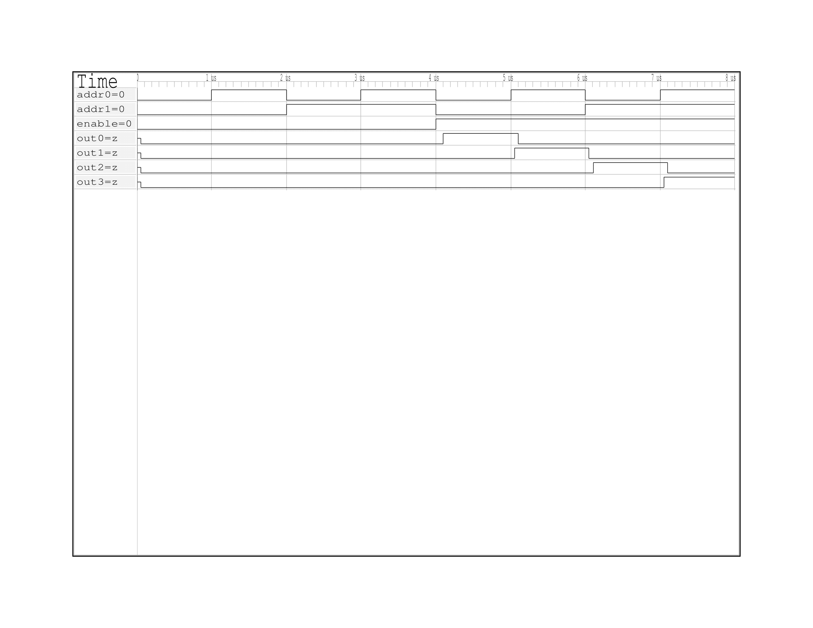
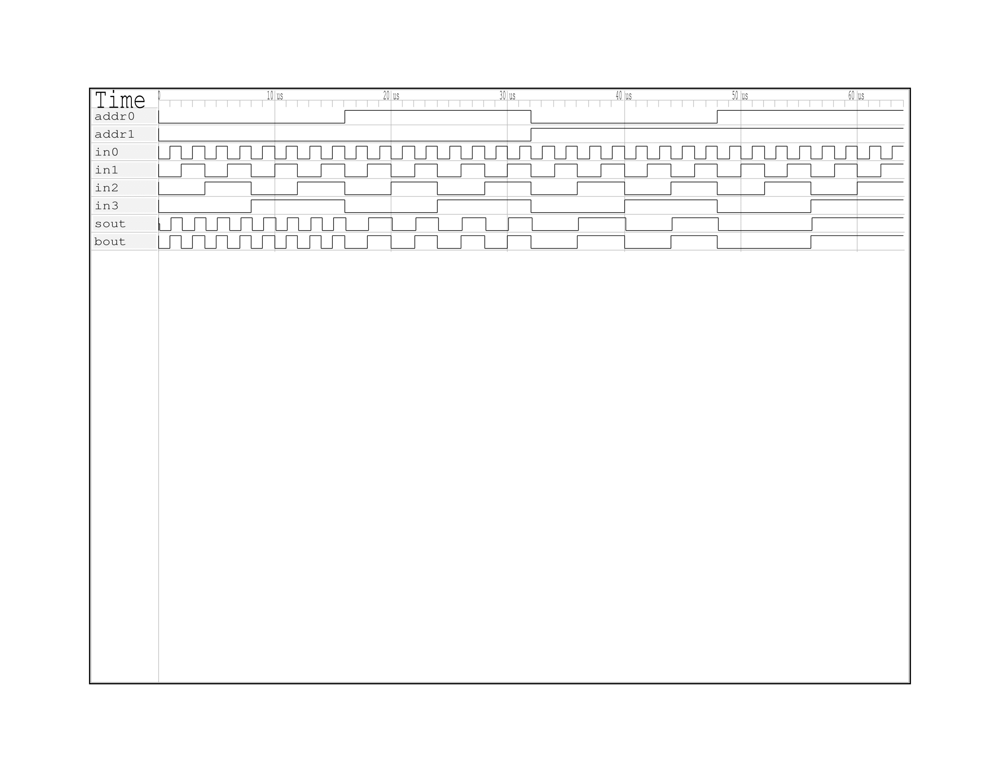
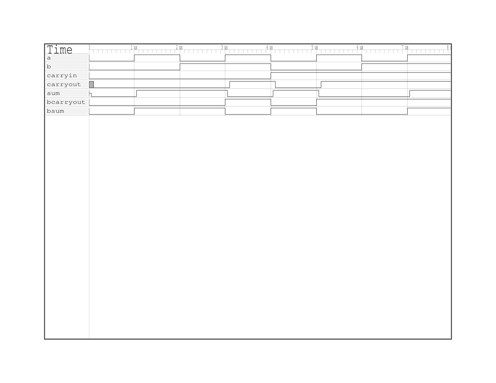

# HW2 Writeup
Jee Hyun Kim

## Decoder
### test bench results
<pre>
En A0 A1| O0 O1 O2 O3 | Expected Output
0  0  0 |  0  0  0  0 | All false
0  1  0 |  0  0  0  0 | All false
0  0  1 |  0  0  0  0 | All false
0  1  1 |  0  0  0  0 | All false
1  0  0 |  1  0  0  0 | O0 Only
1  1  0 |  0  1  0  0 | O1 Only
1  0  1 |  0  0  1  0 | O2 Only
1  1  1 |  0  0  0  1 | O3 Only
</pre>
### Timing Digram

## Multiplexer
### test bench results
<pre>
i0 i1 i2 i3 |A0 A1|out expected_output
 0  0  0  0 | 0  0| 0         0
 1  0  0  0 | 0  0| 1         1
 0  1  0  0 | 0  0| 0         0
 1  1  0  0 | 0  0| 1         1
 0  0  1  0 | 0  0| 0         0
 1  0  1  0 | 0  0| 1         1
 0  1  1  0 | 0  0| 0         0
 1  1  1  0 | 0  0| 1         1
 0  0  0  1 | 0  0| 0         0
 1  0  0  1 | 0  0| 1         1
 0  1  0  1 | 0  0| 0         0
 1  1  0  1 | 0  0| 1         1
 0  0  1  1 | 0  0| 0         0
 1  0  1  1 | 0  0| 1         1
 0  1  1  1 | 0  0| 0         0
 1  1  1  1 | 0  0| 1         1
 0  0  0  0 | 1  0| 0         0
 1  0  0  0 | 1  0| 0         0
 0  1  0  0 | 1  0| 1         1
 1  1  0  0 | 1  0| 1         1
 0  0  1  0 | 1  0| 0         0
 1  0  1  0 | 1  0| 0         0
 0  1  1  0 | 1  0| 1         1
 1  1  1  0 | 1  0| 1         1
 0  0  0  1 | 1  0| 0         0
 1  0  0  1 | 1  0| 0         0
 0  1  0  1 | 1  0| 1         1
 1  1  0  1 | 1  0| 1         1
 0  0  1  1 | 1  0| 0         0
 1  0  1  1 | 1  0| 0         0
 0  1  1  1 | 1  0| 1         1
 1  1  1  1 | 1  0| 1         1
 0  0  0  0 | 0  1| 0         0
 1  0  0  0 | 0  1| 0         0
 0  1  0  0 | 0  1| 0         0
 1  1  0  0 | 0  1| 0         0
 0  0  1  0 | 0  1| 1         1
 1  0  1  0 | 0  1| 1         1
 0  1  1  0 | 0  1| 1         1
 1  1  1  0 | 0  1| 1         1
 0  0  0  1 | 0  1| 0         0
 1  0  0  1 | 0  1| 0         0
 0  1  0  1 | 0  1| 0         0
 1  1  0  1 | 0  1| 0         0
 0  0  1  1 | 0  1| 1         1
 1  0  1  1 | 0  1| 1         1
 0  1  1  1 | 0  1| 1         1
 1  1  1  1 | 0  1| 1         1
 0  0  0  0 | 1  1| 0         0
 1  0  0  0 | 1  1| 0         0
 0  1  0  0 | 1  1| 0         0
 1  1  0  0 | 1  1| 0         0
 0  0  1  0 | 1  1| 0         0
 1  0  1  0 | 1  1| 0         0
 0  1  1  0 | 1  1| 0         0
 1  1  1  0 | 1  1| 0         0
 0  0  0  1 | 1  1| 1         1
 1  0  0  1 | 1  1| 1         1
 0  1  0  1 | 1  1| 1         1
 1  1  0  1 | 1  1| 1         1
 0  0  1  1 | 1  1| 1         1
 1  0  1  1 | 1  1| 1         1
 0  1  1  1 | 1  1| 1         1
 1  1  1  1 | 1  1| 1         1
</pre>
### Timing Digram

## Full Adder
### test bench results
<pre>
Full Adder         Expected
 A B Cin | S Cout   S Cout
 0 0  0  | 0   0    0   0
 1 0  0  | 1   0    1   0
 0 1  0  | 1   0    1   0
 1 1  0  | 0   1    0   1
 0 0  1  | 1   0    1   0
 1 0  1  | 0   1    0   1
 0 1  1  | 0   1    0   1
 1 1  1  | 1   1    1   1
</pre>
### Timing Digram
