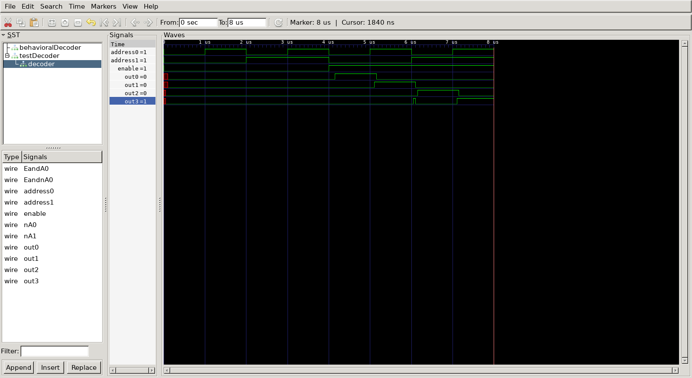
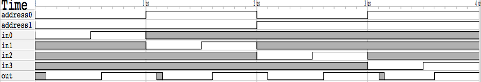
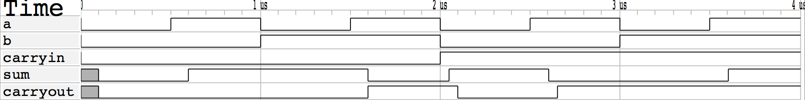

# CompArch HW2 Write Up

## Decoder

### Test Bench Results
```
En A0 A1| O0 O1 O2 O3 | Expected Output
0  0  0 |  0  0  0  0 | All false
0  1  0 |  0  0  0  0 | All false
0  0  1 |  0  0  0  0 | All false
0  1  1 |  0  0  0  0 | All false
1  0  0 |  1  0  0  0 | O0 Only
1  1  0 |  0  1  0  0 | O1 Only
1  0  1 |  0  0  1  0 | O2 Only
1  1  1 |  0  0  0  1 | O3 Only
```
### Waveforms



## Multiplexer
### Test Bench Results
```
A0 A1 | I0 I1 I2 I3| Out | Expected Output
0  0  | 0  x  x  x |   0 | 0
0  0  | 1  x  x  x |   1 | 1
1  0  | x  0  x  x |   0 | 0
1  0  | x  1  x  x |   1 | 1
0  1  | x  x  0  x |   0 | 0
0  1  | x  x  1  x |   1 | 1
1  1  | x  x  x  0 |   0 | 0
1  1  | x  x  x  1 |   1 | 1 
```
### Waveforms



## Adder
### Test Bench Results
```
A  B  CI | Sum CO | Sum CO (Expected Output)
0  0  0  |   0  0 | 0   0
1  0  0  |   1  0 | 1   0
0  1  0  |   1  0 | 1   0
1  1  0  |   0  1 | 0   1
0  0  1  |   1  0 | 1   0
1  0  1  |   0  1 | 0   1
0  1  1  |   0  1 | 0   1
1  1  1  |   1  1 | 1   1
```
### Waveforms

